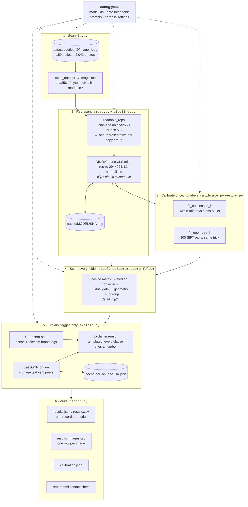
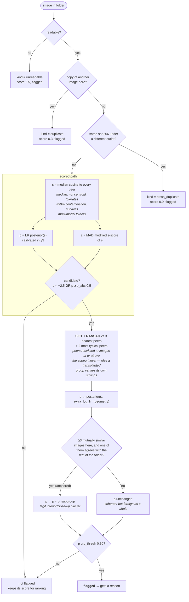
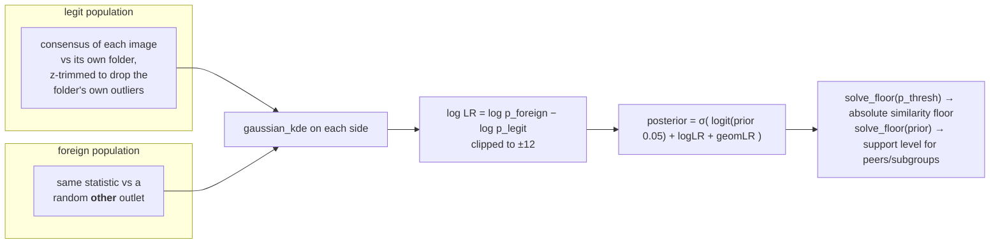
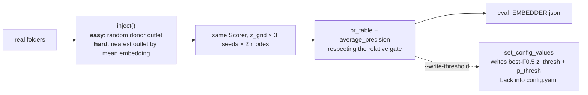
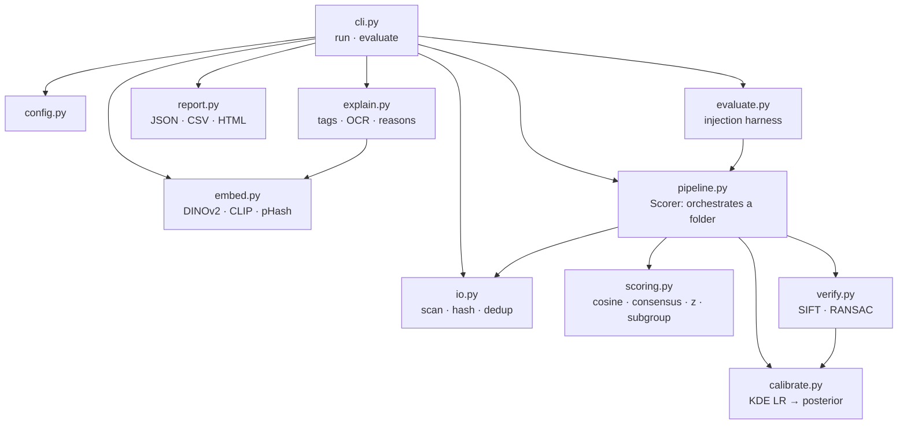

# Architecture

How `outlet-audit` turns a folder of outlet photos into flagged images with reasons.
Code map is in [README.md](README.md#layout); method and numbers in [WRITEUP.md](WRITEUP.md).

The whole system is one batch CLI. No services, no database, no queue: files in, files out,
with a content-hash cache so a rerun only pays for new photos.

---

## 1. End-to-end: `outlet-audit run`

Only flagged images are tagged and OCR'd — that is why a cold full run is ~1 h instead of ~20 h.

---

## 2. The decision for one image

`Scorer.score_folder` runs per outlet folder. Everything below is per image inside that folder.

Two folder-level escapes, because per-image rules cannot always work:

| case | rule | result |
|---|---|---|
| folder has exactly 2 usable images | no relative gate is possible from one shared similarity | both flagged as `pair` if they fail the absolute floor |
| folder median consensus < `gate.folder_review_floor` 0.45 | folder holds several places; per-image flags unreliable | `review_folder: true`, reviewer looks at the whole folder |

---

## 3. Calibration without labels

The dataset has no ground truth, so both thresholds are learned from the data's own structure:
images inside one folder are *presumed legit*, images from a *different outlet* are
*guaranteed foreign*. Same machinery (`calibrate.fit_lr`) serves both stages.

Geometry gets the identical treatment: legit = image vs its own folder's peer set,
foreign = the same image vs another outlet's peer set, statistic = `log1p(max inliers)`,
floored at RANSAC's 4-match minimum so the sparse 0-inlier bin cannot flip sign between runs.

Both log-LRs add, naive-Bayes style — appearance and geometry are treated as independent evidence.

---

## 4. `outlet-audit evaluate` — the validation harness

No labels exist, so labels are manufactured: transplant photos between outlets and check
whether the pipeline finds them.

Baselines (`--embedder clip|phash`, `--no-geometry`) run through the exact same harness, so the
comparison isolates one variable at a time. The harness scores every original image as legit,
which makes its precision a lower bound — real foreign originals that the pipeline correctly
catches count as errors there.

---

## 5. Data and caching

Everything expensive is keyed by **sha256 of the file bytes**, namespaced by model and
preprocessing. Adding new visits to a folder re-embeds only the new files; folder statistics are
recomputed from cache in seconds.

| cache | holds | written by |
|---|---|---|
| `cache/facebook__dinov2-base_294x224_cls/SHA.npy` | 768-d embedding | `embed.embed_records` |
| `cache/openai__clip-vit-base-patch32_squash/SHA.npy` | CLIP embedding for tags | same |
| `cache/sift_640_2000/SHA.npz` | SIFT keypoints + descriptors | `verify.GeomVerifier.features` |
| `cache/ocr_bn_en/SHA.json` | OCR text + confidences | `explain.OCR.read` |

Module boundaries, one responsibility each:

`pipeline.Scorer` is the only place that knows the full decision; `cli.py` and `evaluate.py` both
drive it, which is why harness numbers describe the code that actually ships.
